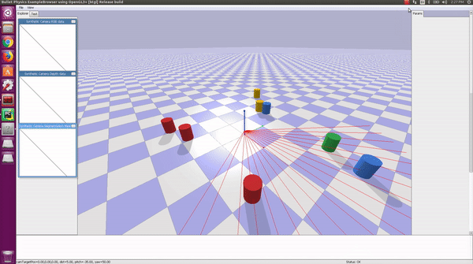

## Turntable Controller



The repository contains a simple implementation of how to learn data-driven dynamic models of task-relevant features for control. In the above example, the goal of the simple turntable controller is to point to a direction where obstacles are not present (or are farthest away). The turntable is fitted with a 2D laser scanner to detect obstacles. The state of the system is defined by a 100-dimensional vector of laser points. We learn the latent space of task-relevant features and its dynamics using a variational auto-encoder (VAE). Using the learned dynamics we use a model-predictive controller to complete the task. 

## Dependencies

It is recommended to work on a `virtualenv`. Install [`virtualenvwrapper`](http://virtualenvwrapper.readthedocs.io/en/latest/install.html) and activate a virtual environment. Install CUDA 9.0 [[Tutorial](https://yangcha.github.io/CUDA90/)]. Install other dependencies by running:
```bash 
(env) $ pip install numpy matplotlib pybullet tensorflow-gpu keras cvxpy==0.4.11
```

## Collect Dataset

Example datasets are provided in `data/`. Data can also be collected by running: 
```bash 
(env) $ python collect_data.py [path/to/data.txt]
```

Each line in the data file denotes the ground truth state of the system:
```bash
u u_dot x_1 x_2 ... x_100
```
where `u`, `u_dot`, and `x_i` denotes current angle, angular velocity, and laser scan values. Before collecting a dataset you can modify the values of `NUM_OBSTACLES`, `WORLD_SAMPLES`, and `CONTROL_SAMPLES` in `params.py` to generate different datasets.

## Train Model

The VAE can be trained by running:
```bash 
(env) $ python train.py [path/to/data_training.txt] [path/to/data_testing.txt]
```

Learned weights are provided in `weights/`. Set `TRAINED = True` in `params.py` to use them. Other training parameters can also be modified. Visualize the predictions by running:
```bash 
(env) $ python test.py [path/to/data_testing.txt]
```

## Model-predictive Control (MPC)

Once the model is trained, run MPC to point the turntable to an obstacle-free direction:
```bash 
(env) $ python mpc.py
```

Each time a random world is generated.